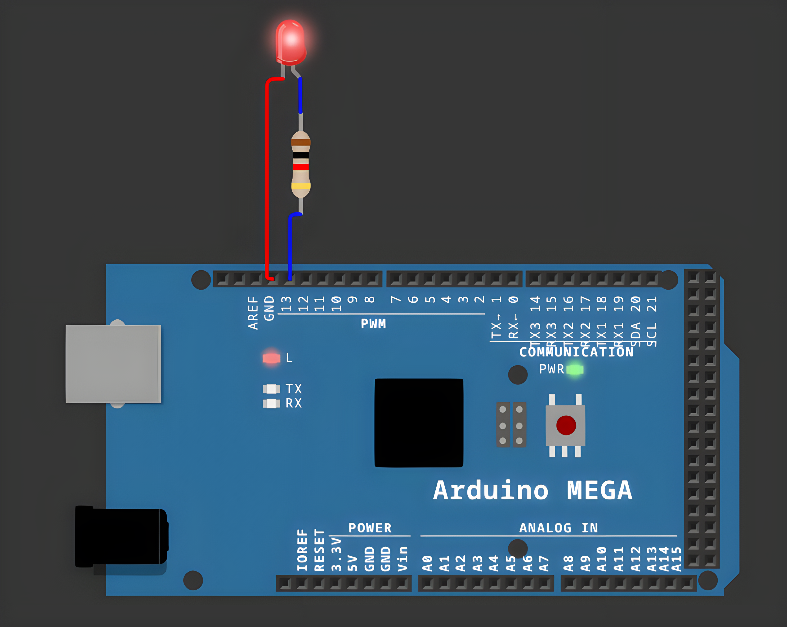

# Serial LED Control

<table align="center">
  <tr>
    <td align="center">
      
    </td>
  </tr>
</table>

## Overview

Serial LED Control is an embedded application for Arduino Mega that lets a user turn an LED on,
off, or toggle it by typing simple text commands into a serial terminal, using the STDIO library
for input/output.

## Features

- **Serial Command Interpreter**: Reads text commands from the serial terminal and executes the
  matching action.
- **LED Control**: Supports `led on`, `led off` and `led toggle` commands.
- **Command Confirmation**: Replies with a clear text message after every executed command.
- **Invalid Command Handling**: Responds with an error message for unrecognized input instead of
  failing silently.
- **Cross-Platform Ready**: Uses a conditional STDIO setup (`#ifdef ARDUINO_ARCH_ESP32`) so the
  same codebase can be adapted for both AVR (Arduino Mega) and ESP32 boards.
- **Clean Architecture**: LED control, serial communication and command interpretation are
  separated into dedicated components for readability and reuse.

## Technologies

- **Platform**: Arduino Mega
- **Language**: C++ (Arduino Framework)
- **Build System**: PlatformIO
- **Simulation**: Wokwi
- **Development Tools**: Visual Studio Code + PlatformIO IDE
- **Version Control**: Git, GitHub

## Project Structure

```
src/
├── app_serial_terminal/
│   ├── app_serial_terminal.cpp
│   └── app_serial_terminal.h
├── ed_led/
│   ├── ed_led.cpp
│   └── ed_led.h
├── srv_stdio_serial/
│   ├── srv_stdio_serial.cpp
│   └── srv_stdio_serial.h
└── main.cpp
diagram.json
wokwi.toml
platformio.ini
```

## Commands

| Command | Action |
|---|---|
| `led on` | Turns the LED on |
| `led off` | Turns the LED off |
| `led toggle` | Switches the LED state and confirms the new state |
| *(anything else)* | Replies with an "unknown command" error message |

## Resources

- [Wokwi Documentation](https://docs.wokwi.com/)
- [Arduino Debounce Tutorial](https://www.arduino.cc/en/Tutorial/Debounce)
- [PlatformIO Documentation](https://docs.platformio.org/)

## Installation

To build and run the application, follow these steps:

1. **Clone this repository:**
```bash
git clone https://github.com/Constantin-Stamate/serial-led-control
```

2. **Navigate to the project directory:**
```bash
cd serial-led-control
```

3. **Open the project in VS Code with the PlatformIO extension installed.**

4. **Build and upload to the board (or run the Wokwi simulation):**
```bash
pio run --target upload
```

5. **Open the serial monitor and type a command:**
```bash
pio device monitor
```
```
led on
led off
led toggle
```

## Contributors

**Serial LED Control** was developed as part of the Internet of Things laboratory works.

- GitHub: [Constantin-Stamate](https://github.com/Constantin-Stamate)
- Email: constantinstamate.r@gmail.com